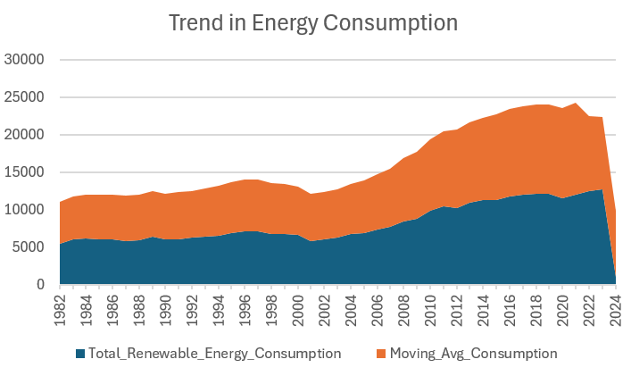
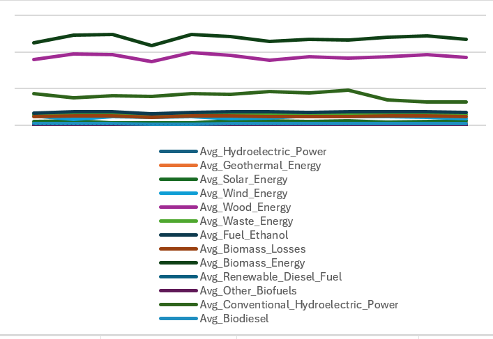
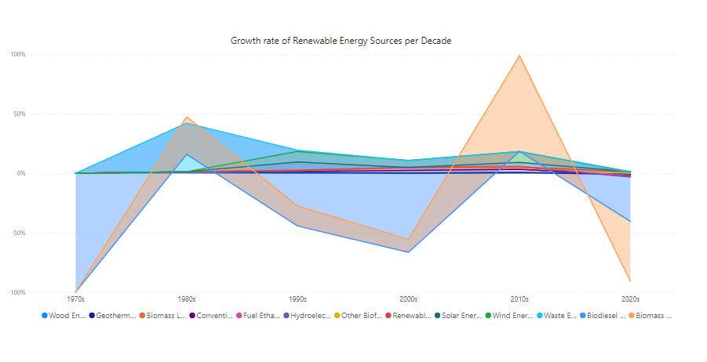
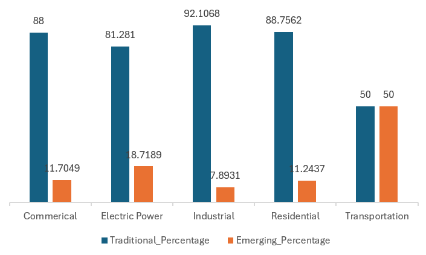

# Data Portfolio:  Analysis of Long-Term Trends and Seasonal Variations in Renewable Energy Consumption

# Table of contents 
- [Executive Summary](#executive-summary)
	-[Objectives](#objectives)
- [Data Source](#data-source)
-[Tools](#tools)
-[Development](#development)
- [Analysis](#analysis) ***
  - [Exploratory Data Analysis](#exploratory-data-analysis)
 	 - [Findings](#findings)   ***

- [Recommendations](#recommendations)
- [Feasibility](#feasibility)
- [Conclusion](#conclusion)


# Executive Summary

This data project aims to analyze the long-term trends and seasonal variations in renewable energy consumption from 1973 to 2024, across different sectors and energy sources. With a growing focus on sustainable energy, understanding these patterns is crucial for policymakers, industry stakeholders, and researchers. Our comprehensive analysis will explore how renewable energy consumption has evolved over the past five decades, highlighting key trends, growth rates, and the impact of emerging renewable energy sources compared to traditional ones. The findings will offer insights into the factors driving the increase in renewable energy usage and how seasonal variations affect consumption patterns.
## Objectives
Objectives:
1.	Long-Term Trends Analysis:
o	Identify and analyze long-term trends in total renewable energy consumption across various sectors from 1973 to 2024.
o	Compare and contrast these trends to understand sector-specific differences in renewable energy adoption.
2.	Seasonal Variation Impact:
o	Examine how seasonal variations affect the consumption of each type of renewable energy (solar, wind, hydroelectric, etc.).
o	Determine patterns or anomalies in seasonal consumption across different renewable energy sources.
3.	Sectoral Growth Analysis:
o	Identify the sector that shows the most significant increase in renewable energy consumption.
o	Investigate the factors driving the growth in renewable energy consumption in the leading sector.
4.	Growth Rate Comparison:
o	Calculate the growth rate of each renewable energy source over different periods (1970s, 1980s, etc.).
o	Compare these growth rates to understand the evolution of renewable energy sources over time.
5.	Emerging vs. Traditional Renewable Sources:
o	Assess the contribution of emerging renewable energy sources (e.g., solar and wind) compared to traditional ones (e.g., hydroelectric) over the study period.
o	Analyze the shift in energy consumption patterns from traditional to emerging renewable sources and its implications.


## User Story
As a policy analyst focused on energy sustainability, it is essential to base policy recommendations on accurate and comprehensive data. Understanding how renewable energy consumption has evolved over the past five decades, including the impact of seasonal variations, is crucial for crafting effective policies that encourage the adoption of renewable energy.																			

# Data Source
- What data is needed to achieve our objective?
We need data on the Impact of Adventure Works Airlines’ Loyalty Campaign Programs on Flight Bookings that includes customer’s:
-	Customer Lifetime Value,
-	Enrolment Type,
-	Cancellation Year,
-	Cancellation Month
-	Total Flights Booked,
-	Distance,
-	Points Accumulated,
-	Points Redeemed,
-	Dollar Cost  Points  Redeemed 

 Where is the data coming from? 
The data is sourced from Kaggle (an Excel extract. The types of data involved are structured and quantitative.


# Tools 
| Tool | Purpose |
| --- | --- |
| Excel | Exploring the data |
| SQL Server | Cleaning, testing, and analyzing the data |
| Power BI | Visualizing the data via interactive dashboards |
| GitHub | Hosting the project documentation and version control |

# Development

- What's the general approach in creating this solution from start to finish?

1. Get the data
2. Explore the data in Excel
3. Load the data into SQL Server
4. Generate the findings based on the insights
5. Visualize the data in Power BI
6. Write the documentation + commentary
7. Publish the data to GitHub Pages


# Analysis 

## Exploratory Data Analysis

For this analysis, we're going to focus on the questions below to get the information we need for our marketing client  and executives- 
Here are the key questions we need to answer for our marketing client: 
 1. What are the long-term trends in total renewable energy consumption across the sectors from 1973 to 2024 and how do they differ?

 2. How does the seasonal variation affect the consumption of each type of renewable energy?
3. Which sector shows the most significant increase in renewable energy consumption, and what factors might be driving this trend?
4. What is the growth rate of each renewable energy source, and how does this compare over different periods (e.g., 1970s, 1980s, etc.)?

5. What is the contribution of emerging renewable energy sources (e.g., solar and wind) compared to traditional ones (e.g., hydroelectric) over time?


### 1. What are the long-term trends in total renewable energy consumption across the sectors from 1973 to 2024 and how do they differ?

```sql
WITH YearlyTotals AS (
    SELECT
        years,
        SUM(Hydroelectric_Power + Geothermal_Energy + Solar_Energy + Wind_Energy + Wood_Energy + Waste_Energy + Fuel_Ethanol + Biomass_Losses + 
		Biomass_Energy + Renewable_Diesel_Fuel + Other_Biofuels + Conventional_Hydroelectric_Power + Biodiesel) AS Total_Renewable_Energy_Consumption
    FROM renewable_data
    GROUP BY years
),
MovingAvg AS (
    SELECT
        years,
        AVG(SUM(Hydroelectric_Power + Geothermal_Energy + Solar_Energy + Wind_Energy + Wood_Energy + Waste_Energy + Fuel_Ethanol + Biomass_Losses + 
		Biomass_Energy + Renewable_Diesel_Fuel + Other_Biofuels + Conventional_Hydroelectric_Power +Biodiesel
   )) OVER (ORDER BY years ROWS BETWEEN 2 PRECEDING AND 2 FOLLOWING) AS Moving_Avg_Consumption
    FROM renewable_data
    GROUP BY years
)
SELECT
    yt.years,
    yt.Total_Renewable_Energy_Consumption,
    ma.Moving_Avg_Consumption
FROM YearlyTotals yt
JOIN MovingAvg ma ON yt.years = ma.years
ORDER BY yt.years;
```

The long-term trends in total renewable energy consumption from 1973 to 2024 reveal a significant upward trajectory, reflecting increased global adoption of renewable energy sources. 
Across all sectors there was a significant increase in consumption in the 1984 this may have been attributed to the implementation of early renewable energy incentives and policies aimed at reducing dependence on fossil fuels. The Public Utility Regulatory Policies Act (PURPA) of 1978, which promoted renewable energy projects by requiring utilities to purchase power from independent producers, may have played a significant role during this period.
 However, in the early 2000s we notice a dip which is likely because of to economic downturns and the bursting of the dot-com bubble, which diverted focus and funding away from renewable energy investments. The Energy Policy Act of 2005 later revitalized the sector by introducing tax incentives and loan guarantees for renewable energy projects.
Between 2005-2019 we notice a gradual increase in consumption, this may have been due to technology advancement and new laws introduced. The introduction of the Energy Independence and Security Act (EISA) of 2007, which aimed to improve energy efficiency and increase the production of renewable fuels, and technological advancements in solar and wind energy, significantly contributed to this growth
In 2020, there was a dip which was likely caused by COVID pandemic which led to supply chain disruptions, lockdown measures, and financing challenges. 
Our data shows a significant fall in the moving average this is because the data provided only shows the first few months within 2024 as the year is ongoing.


### 2. How does the seasonal variation affect the consumption of each type of renewable energy?

```sql
WITH MonthlyTotals AS (
    SELECT
        months,
        SUM(Hydroelectric_Power) AS Total_Hydroelectric_Power,
        SUM(Geothermal_Energy) AS Total_Geothermal_Energy,
        SUM(Solar_Energy) AS Total_Solar_Energy,
        SUM(Wind_Energy) AS Total_Wind_Energy,
        SUM(Wood_Energy) AS Total_Wood_Energy,
        SUM(Waste_Energy) AS Total_Waste_Energy,
        SUM(Fuel_Ethanol) AS Total_Fuel_Ethanol,
        SUM(Biomass_Losses) AS Total_Biomass_Losses,
        SUM(Biomass_Energy) AS Total_Biomass_Energy,
        SUM(Renewable_Diesel_Fuel) AS Total_Renewable_Diesel_Fuel,
        SUM(Other_Biofuels) AS Total_Other_Biofuels,
		SUM(Conventional_Hydroelectric_Power) AS Total_Conventional_Hydroelectric_Power,
        SUM(Biodiesel) AS Total_Biodiesel
    FROM renewable_data
    GROUP BY months
)

-- Calculate average consumption for each month across all years
SELECT
    months,
    AVG(Total_Hydroelectric_Power) AS Avg_Hydroelectric_Power,
    AVG(Total_Geothermal_Energy) AS Avg_Geothermal_Energy,
    AVG(Total_Solar_Energy) AS Avg_Solar_Energy,
    AVG(Total_Wind_Energy) AS Avg_Wind_Energy,
    AVG(Total_Wood_Energy) AS Avg_Wood_Energy,
    AVG(Total_Waste_Energy) AS Avg_Waste_Energy,
    AVG(Total_Fuel_Ethanol) AS Avg_Fuel_Ethanol,
    AVG(Total_Biomass_Losses) AS Avg_Biomass_Losses,
    AVG(Total_Biomass_Energy) AS Avg_Biomass_Energy,
    AVG(Total_Renewable_Diesel_Fuel) AS Avg_Renewable_Diesel_Fuel,
    AVG(Total_Other_Biofuels) AS Avg_Other_Biofuels,
	AVG(Total_Conventional_Hydroelectric_Power) AS Avg_Conventional_Hydroelectric_Power,
    AVG(Total_Biodiesel) AS Avg_Biodiesel
FROM MonthlyTotals
GROUP BY months
ORDER BY months;
```



-	Biodiesel: The highest average consumption in a month appears to be September which likely due to increased agricultural activities requiring more fuel during harvest season and the lowest average consumption appears to be in February due to reduced transportation and agricultural activities during winter months lower biodiesel demand.
-	The chart shows the highest average consumption in a month for Biomass Energy and Geothermal Energy appears to be January which is likely due to increased heating demands during winter and the lowest average consumption appears to be in February which may be as a result of it being the shortest month may contribute to lower overall consumption, coupled with slightly reduced heating needs pos t-January peak.
-	The chart shows the highest average consumption in a month for  Biomass Losses, Other Biofuels and Waste appears to be December. This may be as a result of high heating demand during peak winter. The lowest average consumption appears to be in February which may be as a result of it being the shortest month may contribute to lower overall consumption, coupled with slightly reduced heating needs post-January peak.
-	Conventional Hydroelectric Power: The highest average consumption in a month appears to be May due to spring snowmelt increases water flow, enhancing hydroelectric power generation and the lowest average consumption appears to be in October due to reduced water levels after the summer dry season lower hydroelectric generation.
-	Fuel Ethanol: The highest average consumption in a month appears to be October as a result of the increased demand during harvest season and beginning of heating season and the lowest average consumption appears to be in February which may be due to it being the shortest month
-	consumption.
-	Hydroelectric Energy: The highest average consumption in a month appears to be May. Similar to conventional hydroelectric power, this may due to it benefiting from spring thaw. The lowest average consumption appears to be in September which may be due to reduced water levels.
-	Solar: The highest average consumption in a month appears to be July. This may be due to the fact that July has the longest daylight hours and strongest sunlight.  The lowest average consumption appears to be in February which may because February has short daylight hours and weak sunlight.
-	Wind: The highest average consumption in a month appears to be April which may be as a result of spring and the wind. The lowest average consumption appears to be in August, which has strong sunlight and little wind.
-	Wood: The highest average consumption in a month appears to be August. This may be as a result of increased outdoor and recreational activities contribute to higher wood energy consumption and the lowest average consumption appears to be in February which may be as a result of reduced outdoor activities.


The chart indicates that there is a pattern in the number of flights booked in specific months in a year. In both 2017 and 2018, the months with the highest number of flights being June and July and the months with the least number of flight bookings being January and February. 
As July falls during summer, people tend to travel to various destinations. This may be responsible for the increase in the number of flights

With January being the peak of winter, it is likely that many would not want to travel. Therefore, reducing the number of flight bookings.
Additionally, the chart indicates there was an increase in the number of flight bookings in July 2018 in comparison with the number of flight bookings in July 2018. It is likely the 2018 Promotions was responsible for the increase.


### 3. Which sector shows the most significant increase in renewable energy consumption, and what factors might be driving this trend?

```sql
-- Calculate total renewable energy consumption for each sector
WITH SectorYearlyTotals AS (
    SELECT
        Sector,
        years,
        SUM(
            Hydroelectric_Power + Geothermal_Energy + Solar_Energy + Wind_Energy +
            Wood_Energy + Waste_Energy + Fuel_Ethanol + Biomass_Losses +
            Biomass_Energy + Renewable_Diesel_Fuel + Other_Biofuels +
            Conventional_Hydroelectric_Power + Biodiesel
        ) AS TotalRenewableEnergy
    FROM renewable_data
    GROUP BY Sector, years
),
SectorGrowth AS (
    SELECT
        Sector,
        years,
        TotalRenewableEnergy,
        LAG(TotalRenewableEnergy) OVER (PARTITION BY Sector ORDER BY years) AS PreviousYearEnergy,
        TotalRenewableEnergy - LAG(TotalRenewableEnergy) OVER (PARTITION BY Sector ORDER BY years) AS GrowthAmount,
        ((TotalRenewableEnergy - LAG(TotalRenewableEnergy) OVER (PARTITION BY Sector ORDER BY years)) / NULLIF(LAG(TotalRenewableEnergy) OVER (PARTITION BY Sector ORDER BY years), 0)) * 100 AS GrowthRate
    FROM SectorYearlyTotals
)
SELECT
    Sector,
    sum(GrowthRate) as total_growth_rate
FROM SectorGrowth
group by Sector
ORDER BY total_growth_rate  DESC


```
The Transportation Sector shows the highest growth rate of 613.14%.
-	Reasons:
-	Policy Incentives: Strong government policies and subsidies for biofuels and electric vehicles (EVs) have significantly boosted renewable energy usage in transportation.
-	Technological Advancements: Improvements in battery technology and increased production of EVs have led to higher adoption rates.
-	Corporate Commitments: Many companies have committed to reducing carbon emissions, leading to increased use of renewable fuels in fleets.
-	Market Demand: Growing consumer demand for sustainable transportation options has driven the sector’s growth.


###4. What is the growth rate of each renewable energy source, and how does this compare over different periods (e.g., 1970s, 1980s, etc.)?

```sql

WITH PeriodAggregates AS (
    SELECT
        CASE
            WHEN years BETWEEN 1970 AND 1979 THEN '1970s'
            WHEN years BETWEEN 1980 AND 1989 THEN '1980s'
            WHEN years BETWEEN 1990 AND 1999 THEN '1990s'
            WHEN years BETWEEN 2000 AND 2009 THEN '2000s'
            WHEN years BETWEEN 2010 AND 2019 THEN '2010s'
            WHEN years >= 2020 THEN '2020s'
        END AS Period,
        SUM(Hydroelectric_Power) AS Total_Hydroelectric_Power,
        SUM(Geothermal_Energy) AS Total_Geothermal_Energy,
        SUM(Solar_Energy) AS Total_Solar_Energy,
        SUM(Wind_Energy) AS Total_Wind_Energy,
        SUM(Wood_Energy) AS Total_Wood_Energy,
        SUM(Waste_Energy) AS Total_Waste_Energy,
        SUM(Fuel_Ethanol) AS Total_Fuel_Ethanol,
        SUM(Biomass_Losses) AS Total_Biomass_Losses,
        SUM(Biomass_Energy) AS Total_Biomass_Energy,
        SUM(Renewable_Diesel_Fuel) AS Total_Renewable_Diesel_Fuel,
        SUM(Other_Biofuels) AS Total_Other_Biofuels,
        SUM(Conventional_Hydroelectric_Power) AS Total_Conventional_Hydroelectric_Power,
        SUM(Biodiesel) AS Total_Biodiesel
    FROM renewable_data
    GROUP BY
        CASE
            WHEN years BETWEEN 1970 AND 1979 THEN '1970s'
            WHEN years BETWEEN 1980 AND 1989 THEN '1980s'
            WHEN years BETWEEN 1990 AND 1999 THEN '1990s'
            WHEN years BETWEEN 2000 AND 2009 THEN '2000s'
            WHEN years BETWEEN 2010 AND 2019 THEN '2010s'
            WHEN years >= 2020 THEN '2020s'
        END
),
GrowthRates AS (
    SELECT
        Period,
        Total_Hydroelectric_Power,
        LAG(Total_Hydroelectric_Power) OVER (ORDER BY Period) AS Prev_Hydroelectric_Power,
        ((Total_Hydroelectric_Power - LAG(Total_Hydroelectric_Power) OVER (ORDER BY Period)) / NULLIF(LAG(Total_Hydroelectric_Power) OVER (ORDER BY Period), 0)) * 100 AS Hydroelectric_Growth_Rate,
        
        Total_Geothermal_Energy,
        LAG(Total_Geothermal_Energy) OVER (ORDER BY Period) AS Prev_Geothermal_Energy,
        ((Total_Geothermal_Energy - LAG(Total_Geothermal_Energy) OVER (ORDER BY Period)) / NULLIF(LAG(Total_Geothermal_Energy) OVER (ORDER BY Period), 0)) * 100 AS Geothermal_Growth_Rate,

        Total_Solar_Energy,
        LAG(Total_Solar_Energy) OVER (ORDER BY Period) AS Prev_Solar_Energy,
        ((Total_Solar_Energy - LAG(Total_Solar_Energy) OVER (ORDER BY Period)) / NULLIF(LAG(Total_Solar_Energy) OVER (ORDER BY Period), 0)) * 100 AS Solar_Growth_Rate,

        Total_Wind_Energy,
        LAG(Total_Wind_Energy) OVER (ORDER BY Period) AS Prev_Wind_Energy,
        ((Total_Wind_Energy - LAG(Total_Wind_Energy) OVER (ORDER BY Period)) / NULLIF(LAG(Total_Wind_Energy) OVER (ORDER BY Period), 0)) * 100 AS Wind_Growth_Rate,

        Total_Wood_Energy,
        LAG(Total_Wood_Energy) OVER (ORDER BY Period) AS Prev_Wood_Energy,
        ((Total_Wood_Energy - LAG(Total_Wood_Energy) OVER (ORDER BY Period)) / NULLIF(LAG(Total_Wood_Energy) OVER (ORDER BY Period), 0)) * 100 AS Wood_Growth_Rate,

        Total_Waste_Energy,
        LAG(Total_Waste_Energy) OVER (ORDER BY Period) AS Prev_Waste_Energy,
        ((Total_Waste_Energy - LAG(Total_Waste_Energy) OVER (ORDER BY Period)) / NULLIF(LAG(Total_Waste_Energy) OVER (ORDER BY Period), 0)) * 100 AS Waste_Growth_Rate,

        Total_Fuel_Ethanol,
        LAG(Total_Fuel_Ethanol) OVER (ORDER BY Period) AS Prev_Fuel_Ethanol,
        ((Total_Fuel_Ethanol - LAG(Total_Fuel_Ethanol) OVER (ORDER BY Period)) / NULLIF(LAG(Total_Fuel_Ethanol) OVER (ORDER BY Period), 0)) * 100 AS Fuel_Ethanol_Growth_Rate,

        Total_Biomass_Losses,
        LAG(Total_Biomass_Losses) OVER (ORDER BY Period) AS Prev_Biomass_Losses,
        ((Total_Biomass_Losses - LAG(Total_Biomass_Losses) OVER (ORDER BY Period)) / NULLIF(LAG(Total_Biomass_Losses) OVER (ORDER BY Period), 0)) * 100 AS Biomass_Losses_Growth_Rate,

        Total_Biomass_Energy,
        LAG(Total_Biomass_Energy) OVER (ORDER BY Period) AS Prev_Biomass_Energy,
        ((Total_Biomass_Energy - LAG(Total_Biomass_Energy) OVER (ORDER BY Period)) / NULLIF(LAG(Total_Biomass_Energy) OVER (ORDER BY Period), 0)) * 100 AS Biomass_Growth_Rate,

        Total_Renewable_Diesel_Fuel,
        LAG(Total_Renewable_Diesel_Fuel) OVER (ORDER BY Period) AS Prev_Renewable_Diesel_Fuel,
        ((Total_Renewable_Diesel_Fuel - LAG(Total_Renewable_Diesel_Fuel) OVER (ORDER BY Period)) / NULLIF(LAG(Total_Renewable_Diesel_Fuel) OVER (ORDER BY Period), 0)) * 100 AS Renewable_Diesel_Growth_Rate,

        Total_Other_Biofuels,
        LAG(Total_Other_Biofuels) OVER (ORDER BY Period) AS Prev_Other_Biofuels,
        ((Total_Other_Biofuels - LAG(Total_Other_Biofuels) OVER (ORDER BY Period)) / NULLIF(LAG(Total_Other_Biofuels) OVER (ORDER BY Period), 0)) * 100 AS Other_Biofuels_Growth_Rate,

        Total_Conventional_Hydroelectric_Power,
        LAG(Total_Conventional_Hydroelectric_Power) OVER (ORDER BY Period) AS Prev_Conventional_Hydroelectric_Power,
        ((Total_Conventional_Hydroelectric_Power - LAG(Total_Conventional_Hydroelectric_Power) OVER (ORDER BY Period)) / NULLIF(LAG(Total_Conventional_Hydroelectric_Power) OVER (ORDER BY Period), 0)) * 100 AS Conventional_Hydroelectric_Growth_Rate,

        Total_Biodiesel,
        LAG(Total_Biodiesel) OVER (ORDER BY Period) AS Prev_Biodiesel,
        ((Total_Biodiesel - LAG(Total_Biodiesel) OVER (ORDER BY Period)) / NULLIF(LAG(Total_Biodiesel) OVER (ORDER BY Period), 0)) * 100 AS Biodiesel_Growth_Rate
    FROM PeriodAggregates
)
SELECT
    Period,
    Hydroelectric_Growth_Rate,
    Geothermal_Growth_Rate,
    Solar_Growth_Rate,
    Wind_Growth_Rate,
    Wood_Growth_Rate,
    Waste_Growth_Rate,
    Fuel_Ethanol_Growth_Rate,
    Biomass_Losses_Growth_Rate,
    Biomass_Growth_Rate,
    Renewable_Diesel_Growth_Rate,
    Other_Biofuels_Growth_Rate,
    Conventional_Hydroelectric_Growth_Rate,
    Biodiesel_Growth_Rate
FROM GrowthRates;

```





1980s
-	Hydroelectric Growth Rate: 39.99%
-	Geothermal Growth Rate: 302.40%
-	Wood Growth Rate: 109.97%
-	Waste Growth Rate: 15567.92%
-	Biomass Growth Rate: 120.37%
-	Conventional Hydroelectric Growth Rate: 45.18%
Insights:
-	The 1980s saw significant growth in geothermal and waste energy, driven by initial efforts to diversify energy sources.
-	High growth in waste energy indicates early adoption and increased capacity for waste-to-energy technologies.
1990s
-	Hydroelectric Growth Rate: 46.70%
-	Geothermal Growth Rate: 121.14%
-	Solar Growth Rate: 1073.47%
-	Wind Growth Rate: 1411.51%
-	Wood Growth Rate: -11.29%
-	Waste Growth Rate: 148.94%
-	Fuel Ethanol Growth Rate: 127.46%
-	Biomass Losses Growth Rate: 112.54%
-	Biomass Growth Rate: 26.44%
-	Conventional Hydroelectric Growth Rate: 6.19%
Insights:
-	The 1990s marked the rapid growth of solar and wind energy, reflecting technological advancements and early market adoption.
-	Negative growth in wood energy suggests a shift away from traditional biomass sources towards more efficient renewable technologies.
2000s
-	Hydroelectric Growth Rate: -33.33%
-	Geothermal Growth Rate: 25.99%
-	Solar Growth Rate: -8.63%
-	Wind Growth Rate: 693.39%
-	Wood Growth Rate: -9.60%
-	Waste Growth Rate: -17.60%
-	Fuel Ethanol Growth Rate: 325.85%
-	Biomass Losses Growth Rate: 271.44%
-	Biomass Growth Rate: 12.81%
-	Conventional Hydroelectric Growth Rate: -12.76%
Insights:
-	The 2000s experienced strong growth in wind energy, likely due to improved technologies and cost reductions.
-	Decline in hydroelectric and solar growth rates may be attributed to market saturation and initial challenges in scaling up solar technologies.
2010s
-	Hydroelectric Growth Rate: -41.30%
-	Geothermal Growth Rate: 40.29%
-	Solar Growth Rate: 273.25%
-	Wind Growth Rate: 659.70%
-	Wood Growth Rate: 8.88%
-	Waste Growth Rate: 16.52%
-	Fuel Ethanol Growth Rate: 180.30%
-	Biomass Losses Growth Rate: 189.28%
-	Biomass Growth Rate: 58.21%
-	Conventional Hydroelectric Growth Rate: 6.05%
-	Biodiesel Growth Rate: 913.89%
Insights:
-	Significant growth in solar and wind energy highlights the impact of technological advancements and supportive policies.
-	Biodiesel experienced remarkable growth due to increased demand for sustainable fuels and supportive regulatory frameworks.
2020s
-	Hydroelectric Growth Rate: -74.09%
-	Geothermal Growth Rate: -58.51%
-	Solar Growth Rate: 34.43%
-	Wind Growth Rate: -17.22%
-	Wood Growth Rate: -64.29%
-	Waste Growth Rate: -64.68%
-	Fuel Ethanol Growth Rate: -59.08%
-	Biomass Losses Growth Rate: -58.81%
-	Biomass Growth Rate: -58.93%
-	Renewable Diesel Growth Rate: 114.16%
-	Other Biofuels Growth Rate: 383.04%
-	Conventional Hydroelectric Growth Rate: -62.08%
-	Biodiesel Growth Rate: -48.21%
Insights:
-	The 2020s show significant declines across many renewable sources, likely impacted by the COVID-19 pandemic which caused disruptions in supply chains, reduced demand, and financial challenges.
-	Renewable diesel and other biofuels have shown resilience and continued growth, possibly due to ongoing investments and supportive policies for alternative fuels.


5. What is the contribution of emerging renewable energy sources (e.g., solar and wind) compared to traditional ones (e.g., hydroelectric) over time?
   First, I divided the renewable energy sources into two categories: traditional renewable energy sources and emerging renewable energy sources:

   | Traditional Renewable Energy       | Emerging Renewable Energy         |
|------------------------------------|-----------------------------------|
| Hydroelectric_Power                | Solar_Energy                      |
| Conventional_Hydroelectric_Power   | Wind_Energy                       |
| Wood_Energy                        | Geothermal_Energy                 |
| Waste_Energy                       | Fuel_Ethanol                      |
| Biomass_Energy                     | Biomass_Losses                    |
|                                    | Biodiesel                         |
|                                    | Renewable_Diesel_Fuel             |
|                                    | Other_Biofuels                    |


```sql
WITH EnergyTotals AS (
    SELECT
        Sector,
        SUM(Hydroelectric_Power + Conventional_Hydroelectric_Power + Wood_Energy + Waste_Energy + 
            Biomass_Energy) AS Total_Traditional,
        SUM(Solar_Energy + Wind_Energy + Geothermal_Energy + Fuel_Ethanol + Biomass_Losses + 
            Biodiesel + Renewable_Diesel_Fuel + Other_Biofuels) AS Total_Emerging,
        SUM(
            Hydroelectric_Power + Geothermal_Energy + Solar_Energy + Wind_Energy + 
            Wood_Energy + Waste_Energy + Fuel_Ethanol + Biomass_Losses + 
            Biomass_Energy + Renewable_Diesel_Fuel + Other_Biofuels + 
            Conventional_Hydroelectric_Power + Biodiesel
        ) AS Total_Renewable
    FROM renewable_data
    GROUP BY Sector
)
SELECT
    Sector,
    (Total_Traditional / NULLIF(Total_Renewable, 0)) * 100 AS Traditional_Percentage,
    (Total_Emerging / NULLIF(Total_Renewable, 0)) * 100 AS Emerging_Percentage
FROM EnergyTotals
ORDER BY Sector;

```



- The Commercial Sector uses 88% traditional renewable energy and 11.70% emerging renewable energy. This indicates the commercial sector heavily relies on traditional energy sources. The shift to emerging sources is slow but evident.
- The Electric Power Sector  uses 81.28% traditional renewable energy and 18.7189% emerging renewable energy. This indicates the sector is significantly incorporating emerging energy sources. Nearly 19% reliance on emerging sources indicates a substantial transition towards newer technologies.
- The Industrial Sector uses 92.10% traditional renewable energy and 7.89% emerging renewable energy.This indicates the industrial sector is the most dependent on traditional energy sources. The adoption of emerging energy sources is minimal, highlighting potential barriers to change in this sector.
- The Residential Sectoruses 88.75% traditional renewable energy and 11.24% emerging renewable energy.This indicates the residential energy usage is predominantly traditional. The shift to emerging sources is present but not yet significant.
- The Transportation Sectoruses 50% traditional renewable energy and 50% emerging renewable energy.This indicates the transportation sector shows an equal split between traditional and emerging energy sources, indicating a balanced and significant transition to newer energy forms, possibly due to advancements in electric vehicles and biofuels.


## Findings

- What did we learn?
1. Winter months generally see increased consumption for heating (biomass, geothermal), while renewable sources dependent on natural phenomena like sunlight (solar) and water flow (hydroelectric) peak during specific seasons. 
2. February consistently shows lower consumption across multiple sources, likely due to it being the shortest month and reduced overall activity.
3. The peak in summer (June and July) suggests higher travel activity due to favorable weather, while the low in winter (January and February) suggests reduced travel activity.
3. While there is a positive trend indicating that more points redeemed correlate with more flights booked, other factors also influence these variables.
4. High engagement and effective utilization of the loyalty program are critical for customer retention. Frequent flyers and those who redeem points are more likely to stay loyal to the service

## Recommendations 
